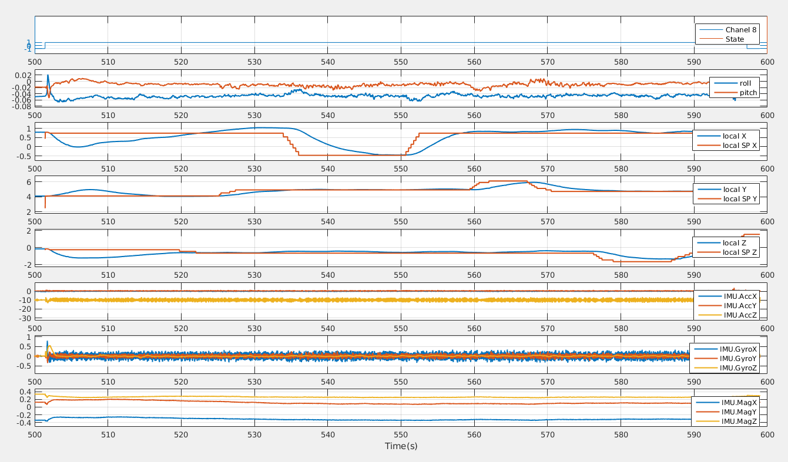
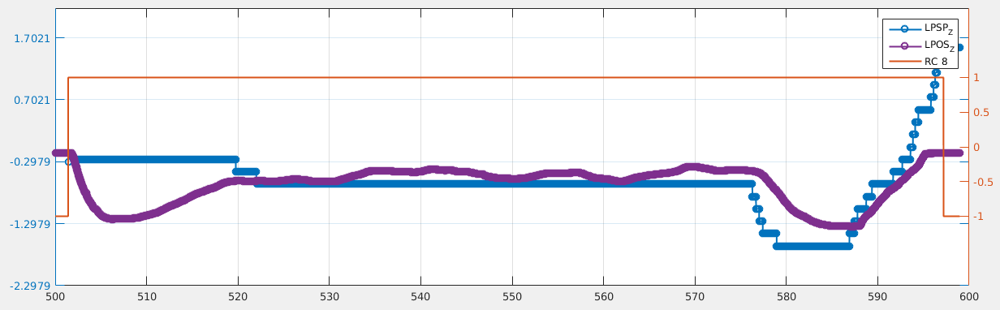

### Introduction
The file `px4log_to_matlab_RC_rename.m` is for analysing PX4 log file, while `px4log_to_matlab.m` is for the old version log format.

### Using
- Set the logfile name to the target one in `px4log_to_matlab_RC_rename.m`
	```
	log_file = '161222.UAV_2_Circle.px4log';	
	```
- Then, simply run in Matalb.
- The code will show the different figures for analysis.
	- For overview
	
	- Each circle is the very moment when the data logged.
	

- Check your data and enjoy your flight. :)

### Notes
- Need Python support. 
  The following code runs the `sdlog_dumpy` to trasnfer the PX4 log file to csv file. 
  ```
  s = system( sprintf('python sdlog2_dump.py "%s" -f "%s" -t"%s" -d"%s" -n"%s"', log_file, data_file, time_field, delim, csv_null) );       
  ```
- `sysvector = tdfread(data_file, ',');` will cost some time to read the csv data into Matlab workspace.
- We save the `sysvector` data to `***.mat` file.
  ```
  sysvector = load(strcat(log_file_name{1}, '.', log_file_name{2},'.mat'));
  ```

### Acknologement
Redeveloped by https://github.com/PX4/Firmware/tree/master/Tools/sdlog2 .
